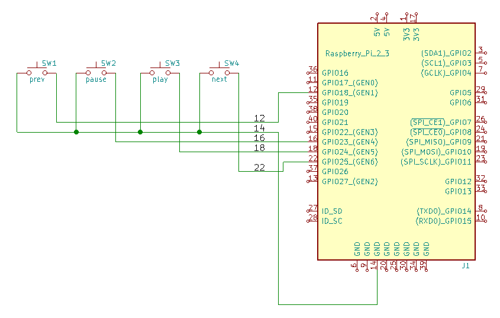

# Push Button Service

Reads the status of GPIO pins of the raspberry pi and triggers
commands for the mpc (music player client).

It is part of the QR-Code Audio-Player:
http://www.zeilhofer.co.at/wiki/doku.php?id=qr-code-player

It is intended to provide a human-machine-interface with tactile
feedback with classic push buttons.

## Schematic

The pins are all in one row, so we can use a single 6-pin female header
which can be easily plugged onto the GPIO header of the raspi.
